# UML Class Diagram — Forecast AI
### Diploma Thesis: Development of an Intelligent System for Forecasting Product Demand Based on Database Technologies and Machine Learning Methods

---

## Что устарело в старой диаграмме

| Старая диаграмма | Проблема |
|-----------------|---------|
| `DataPreprocessor` | Больше не отдельный класс — логика встроена в `ForecastModel` pipeline |
| `ML Model` (один класс) | Заменён на `ForecastModel` + три стратегии (RF/LightGBM/XGBoost) |
| `Database` как класс | Не является UML-классом — это инфраструктура |
| Нет `VerificationCode` | JWT Email-верификация не отражена |
| Нет `AIAssistant` | Весь AI модуль отсутствует |
| Нет `ReportService` | Модуль отчётности отсутствует |
| Нет `AlertService`, `InsightGenerator` | Сервисный слой полностью отсутствует |
| Нет `AdminDashboard` | Модуль администрирования отсутствует |
| `User` без `google_id`, `role` | Атрибуты OAuth и ролей отсутствуют |

---

## Mermaid Code

```mermaid
classDiagram
    %% ─────────────────────────────────────────
    %% AUTHENTICATION MODULE
    %% ─────────────────────────────────────────
    class User {
        +int id
        +String email
        +String hashed_password
        +String full_name
        +String role
        +bool is_verified
        +bool is_active
        +bool is_admin
        +String google_id
        +String avatar_url
        +String subscription_plan
        +DateTime created_at
        +login() AuthToken
        +logout() void
        +updateProfile(name: String) void
    }

    class VerificationCode {
        +String email
        +String code
        +DateTime expires_at
        +bool is_used
        +verify(code: String) bool
        +isExpired() bool
    }

    class JWTService {
        +String secret_key
        +int access_expire_minutes
        +int refresh_expire_days
        +generateAccessToken(user: User) String
        +generateRefreshToken(user: User) String
        +decodeToken(token: String) Payload
        +refreshToken(refresh: String) String
    }

    class GoogleOAuth {
        +String client_id
        +verifyGoogleToken(credential: String) GoogleUser
        +upsertUser(google_user: GoogleUser) User
    }

    %% ─────────────────────────────────────────
    %% PRODUCT & SALES MODULE
    %% ─────────────────────────────────────────
    class Product {
        +String product_id
        +String product_name
        +String category
        +String brand
        +float price
        +String region
        +getSalesHistory() List~SalesRecord~
        +getForecastResults() List~ForecastResult~
    }

    class SalesRecord {
        +int id
        +String product_id
        +Date date
        +int units_sold
        +int inventory_level
        +String region
        +String weather_condition
        +float discount
        +float competitor_pricing
        +bool is_holiday
        +bool is_promotion
    }

    %% ─────────────────────────────────────────
    %% FORECASTING MODULE
    %% ─────────────────────────────────────────
    class ForecastModel {
        +String model_type
        +float accuracy
        +dict metrics
        +DateTime trained_at
        +String cache_key
        +train(records: List~SalesRecord~) void
        +predict(horizon_days: int) List~ForecastResult~
        +evaluate(test_data: DataFrame) dict
        +saveModel(path: String) void
        +loadModel(path: String) void
        +getFeatureImportance() dict
    }

    class RandomForestModel {
        +int n_estimators
        +int max_depth
        +int n_jobs
        +train(records: List~SalesRecord~) void
        +predict(horizon_days: int) List~ForecastResult~
    }

    class LightGBMModel {
        +int n_estimators
        +float learning_rate
        +int num_leaves
        +train(records: List~SalesRecord~) void
        +predict(horizon_days: int) List~ForecastResult~
    }

    class XGBoostModel {
        +int n_estimators
        +float learning_rate
        +float subsample
        +train(records: List~SalesRecord~) void
        +predict(horizon_days: int) List~ForecastResult~
    }

    class ModelCache {
        +dict cache_store
        +get(cache_key: String) ForecastModel
        +put(cache_key: String, model: ForecastModel) void
        +clear(cache_key: String) void
        +getCacheInfo() dict
    }

    class ForecastResult {
        +Date forecast_date
        +float predicted_units
        +float confidence_level
        +float lower_bound
        +float upper_bound
        +String product_id
        +String model_type
    }

    %% ─────────────────────────────────────────
    %% AI ASSISTANT MODULE
    %% ─────────────────────────────────────────
    class AIAssistant {
        +String language
        +String model_type
        +detectIntent(message: String) Intent
        +buildRAGContext(intent: Intent) Context
        +generateResponse(message: String, context: Context) String
        +streamResponse(message: String) Stream
        +getChatHistory(user_id: int) List~ChatMessage~
        +clearHistory(user_id: int) void
    }

    class IntentDetector {
        +List~String~ intent_types
        +detectIntent(message: String) String
        +extractEntities(message: String) dict
    }

    class InsightGenerator {
        +generateInsights(results: List~ForecastResult~) List~Insight~
        +detectRisks(product: Product) List~Risk~
        +detectOpportunities(product: Product) List~Opportunity~
    }

    class AlertService {
        +float stockout_threshold
        +float demand_drop_threshold
        +generateAlerts(product: Product) List~Alert~
        +detectStockoutRisk(record: SalesRecord) Alert
        +detectDemandDrop(results: List~ForecastResult~) Alert
    }

    class SuggestionService {
        +generateSuggestions(insights: List~Insight~, alerts: List~Alert~) List~Suggestion~
    }

    class ChatHistory {
        +int id
        +int user_id
        +String role
        +String content
        +String intent
        +DateTime created_at
    }

    %% ─────────────────────────────────────────
    %% REPORTING MODULE
    %% ─────────────────────────────────────────
    class ReportService {
        +generateForecastReport(product_id: String) Report
        +generateDailyReport() Report
        +generateAnalyticsReport() Report
        +generateKZMarketReport() Report
        +exportExcel(report: Report) bytes
        +exportCSV(report: Report) bytes
    }

    class Report {
        +String report_type
        +DateTime generated_at
        +dict data
        +String format
    }

    %% ─────────────────────────────────────────
    %% ADMINISTRATION MODULE
    %% ─────────────────────────────────────────
    class AdminDashboard {
        +getExecutiveSummary() dict
        +getActiveAlerts() List~Alert~
        +getUserStats() dict
        +getModelMetrics() dict
        +monitorForecasts() List~ForecastResult~
    }

    class UserManagement {
        +listUsers(search: String) List~User~
        +updateUser(user_id: int, data: dict) User
        +deactivateUser(user_id: int) void
        +assignRole(user_id: int, role: String) void
    }

    class RateLimiter {
        +dict limits
        +checkLimit(key: String, endpoint: String) bool
        +recordRequest(key: String) void
    }

    %% ─────────────────────────────────────────
    %% RELATIONSHIPS
    %% ─────────────────────────────────────────

    %% Authentication
    User "1" --> "0..*" VerificationCode : has
    User "1" --> "0..*" ChatHistory : has
    User "1" --> "0..*" ForecastResult : requests
    User "1" --> "0..*" Report : downloads
    JWTService ..> User : authenticates
    GoogleOAuth ..> User : creates/updates

    %% Product & Sales
    Product "1" *-- "1..*" SalesRecord : contains
    Product "1" *-- "0..*" ForecastResult : contains

    %% Forecasting
    ForecastModel <|-- RandomForestModel : extends
    ForecastModel <|-- LightGBMModel : extends
    ForecastModel <|-- XGBoostModel : extends
    ForecastModel "1" --> "1..*" SalesRecord : trains on
    ForecastModel "1" --> "0..*" ForecastResult : generates
    ModelCache "1" o-- "0..*" ForecastModel : caches

    %% AI Assistant
    AIAssistant --> IntentDetector : uses
    AIAssistant --> ForecastResult : analyzes
    AIAssistant --> Product : queries
    AIAssistant --> ChatHistory : persists
    InsightGenerator --> ForecastResult : analyzes
    AlertService --> ForecastResult : monitors
    AlertService --> SalesRecord : monitors
    SuggestionService --> InsightGenerator : uses
    SuggestionService --> AlertService : uses

    %% Reporting
    ReportService --> ForecastResult : exports
    ReportService --> ForecastModel : includes metrics
    ReportService --> Report : creates

    %% Administration
    AdminDashboard --> UserManagement : manages
    AdminDashboard --> ForecastModel : monitors
    AdminDashboard --> AlertService : displays
    UserManagement --> User : manages
```



---

## PlantUML Code

```plantuml
@startuml ForecastAI_ClassDiagram
!theme plain
skinparam classAttributeIconSize 0
skinparam classFontSize 12
skinparam classFontName Arial
skinparam classBackgroundColor #FEFEFE
skinparam classBorderColor #444444
skinparam classArrowColor #333333
skinparam packageBackgroundColor #F0F4FF
skinparam packageBorderColor #7090C0
skinparam linetype ortho

' ─────────────────────────────────────
' AUTHENTICATION MODULE
' ─────────────────────────────────────
package "Authentication Module" #E8F0FE {

    class User {
        +id : int
        +email : String
        +hashed_password : String
        +full_name : String
        +role : String
        +is_verified : bool
        +is_active : bool
        +is_admin : bool
        +google_id : String
        +avatar_url : String
        +subscription_plan : String
        +created_at : DateTime
        --
        +login() : AuthToken
        +logout() : void
        +updateProfile(name) : void
    }

    class VerificationCode {
        +email : String
        +code : String
        +expires_at : DateTime
        +is_used : bool
        --
        +verify(code) : bool
        +isExpired() : bool
    }

    class JWTService {
        +secret_key : String
        +access_expire_minutes : int
        +refresh_expire_days : int
        --
        +generateAccessToken(user) : String
        +generateRefreshToken(user) : String
        +decodeToken(token) : Payload
        +refreshToken(refresh) : String
    }

    class GoogleOAuth {
        +client_id : String
        --
        +verifyGoogleToken(credential) : GoogleUser
        +upsertUser(google_user) : User
    }
}

' ─────────────────────────────────────
' PRODUCT & SALES MODULE
' ─────────────────────────────────────
package "Product & Sales Module" #E8FEF0 {

    class Product {
        +product_id : String
        +product_name : String
        +category : String
        +brand : String
        +price : float
        +region : String
        --
        +getSalesHistory() : List<SalesRecord>
        +getForecastResults() : List<ForecastResult>
    }

    class SalesRecord {
        +id : int
        +product_id : String
        +date : Date
        +units_sold : int
        +inventory_level : int
        +region : String
        +weather_condition : String
        +discount : float
        +competitor_pricing : float
        +is_holiday : bool
        +is_promotion : bool
    }
}

' ─────────────────────────────────────
' FORECASTING MODULE
' ─────────────────────────────────────
package "Forecasting Module" #FEF0E8 {

    abstract class ForecastModel {
        +model_type : String
        +accuracy : float
        +metrics : dict
        +trained_at : DateTime
        +cache_key : String
        --
        +{abstract} train(records : List<SalesRecord>) : void
        +{abstract} predict(horizon_days : int) : List<ForecastResult>
        +evaluate(test_data : DataFrame) : dict
        +saveModel(path : String) : void
        +loadModel(path : String) : void
        +getFeatureImportance() : dict
    }

    class RandomForestModel {
        +n_estimators : int = 300
        +max_depth : int
        +n_jobs : int = -1
        --
        +train(records) : void
        +predict(horizon_days) : List<ForecastResult>
    }

    class LightGBMModel {
        +n_estimators : int = 500
        +learning_rate : float = 0.05
        +num_leaves : int = 63
        --
        +train(records) : void
        +predict(horizon_days) : List<ForecastResult>
    }

    class XGBoostModel {
        +n_estimators : int = 500
        +learning_rate : float = 0.05
        +subsample : float
        --
        +train(records) : void
        +predict(horizon_days) : List<ForecastResult>
    }

    class ModelCache {
        +cache_store : dict
        --
        +get(cache_key) : ForecastModel
        +put(cache_key, model) : void
        +clear(cache_key) : void
        +getCacheInfo() : dict
    }

    class ForecastResult {
        +forecast_date : Date
        +predicted_units : float
        +confidence_level : float
        +lower_bound : float
        +upper_bound : float
        +product_id : String
        +model_type : String
    }
}

' ─────────────────────────────────────
' AI ASSISTANT MODULE
' ─────────────────────────────────────
package "AI Assistant Module" #F8E8FE {

    class AIAssistant {
        +language : String
        +model_type : String
        --
        +detectIntent(message) : Intent
        +buildRAGContext(intent) : Context
        +generateResponse(message, context) : String
        +streamResponse(message) : Stream
        +getChatHistory(user_id) : List<ChatMessage>
        +clearHistory(user_id) : void
    }

    class IntentDetector {
        +intent_types : List<String>
        --
        +detectIntent(message) : String
        +extractEntities(message) : dict
    }

    class InsightGenerator {
        --
        +generateInsights(results) : List<Insight>
        +detectRisks(product) : List<Risk>
        +detectOpportunities(product) : List<Opportunity>
    }

    class AlertService {
        +stockout_threshold : float
        +demand_drop_threshold : float
        --
        +generateAlerts(product) : List<Alert>
        +detectStockoutRisk(record) : Alert
        +detectDemandDrop(results) : Alert
    }

    class SuggestionService {
        --
        +generateSuggestions(insights, alerts) : List<Suggestion>
    }

    class ChatHistory {
        +id : int
        +user_id : int
        +role : String
        +content : String
        +intent : String
        +created_at : DateTime
    }
}

' ─────────────────────────────────────
' REPORTING MODULE
' ─────────────────────────────────────
package "Reporting Module" #FFFDE8 {

    class ReportService {
        --
        +generateForecastReport(product_id) : Report
        +generateDailyReport() : Report
        +generateAnalyticsReport() : Report
        +generateKZMarketReport() : Report
        +exportExcel(report) : bytes
        +exportCSV(report) : bytes
    }

    class Report {
        +report_type : String
        +generated_at : DateTime
        +data : dict
        +format : String
    }
}

' ─────────────────────────────────────
' ADMINISTRATION MODULE
' ─────────────────────────────────────
package "Administration Module" #FEEEEE {

    class AdminDashboard {
        --
        +getExecutiveSummary() : dict
        +getActiveAlerts() : List<Alert>
        +getUserStats() : dict
        +getModelMetrics() : dict
        +monitorForecasts() : List<ForecastResult>
    }

    class UserManagement {
        --
        +listUsers(search) : List<User>
        +updateUser(user_id, data) : User
        +deactivateUser(user_id) : void
        +assignRole(user_id, role) : void
    }

    class RateLimiter {
        +limits : dict
        --
        +checkLimit(key, endpoint) : bool
        +recordRequest(key) : void
    }
}

' ─────────────────────────────────────
' RELATIONSHIPS
' ─────────────────────────────────────

' Authentication
User "1" --> "0..*" VerificationCode : has >
User "1" --> "0..*" ChatHistory : has >
User "1" --> "0..*" ForecastResult : requests >
User "1" --> "0..*" Report : downloads >
JWTService ..> User : authenticates
GoogleOAuth ..> User : creates/updates

' Product & Sales
Product "1" *-- "1..*" SalesRecord : contains >
Product "1" *-- "0..*" ForecastResult : contains >

' Forecasting
ForecastModel <|-- RandomForestModel
ForecastModel <|-- LightGBMModel
ForecastModel <|-- XGBoostModel
ForecastModel "1" --> "1..*" SalesRecord : trains on >
ForecastModel "1" --> "0..*" ForecastResult : generates >
ModelCache "1" o-- "0..*" ForecastModel : caches >

' AI Assistant
AIAssistant --> IntentDetector : uses >
AIAssistant --> ForecastResult : analyzes >
AIAssistant --> Product : queries >
AIAssistant --> ChatHistory : persists >
InsightGenerator --> ForecastResult : analyzes >
AlertService --> ForecastResult : monitors >
AlertService --> SalesRecord : monitors >
SuggestionService --> InsightGenerator : uses >
SuggestionService --> AlertService : uses >

' Reporting
ReportService --> ForecastResult : exports >
ReportService --> ForecastModel : includes metrics >
ReportService --> Report : creates >

' Administration
AdminDashboard --> UserManagement : manages >
AdminDashboard --> ForecastModel : monitors >
AdminDashboard --> AlertService : displays >
UserManagement --> User : manages >

@enduml
```



---

## Объяснение всех классов и связей

### Модуль Аутентификации

| Класс | Назначение |
|-------|-----------|
| **User** | Центральная сущность системы. Хранит данные пользователя, роль (admin/user), тип подписки (free/pro), поля Google OAuth. Связана со всеми основными модулями. |
| **VerificationCode** | 6-значный код для Email-верификации при регистрации. Ограничен по времени (10 мин), одноразовый (`is_used`). |
| **JWTService** | Сервис генерации и валидации JWT токенов. Access token (24ч) + Refresh token (7 дней). Алгоритм HS256. |
| **GoogleOAuth** | Обработка входа через Google. Верифицирует Google ID Token, создаёт/обновляет пользователя (UPSERT). |

### Модуль Товаров и Продаж

| Класс | Назначение |
|-------|-----------|
| **Product** | Товар с атрибутами: ID, название, категория, бренд, цена. Агрегирует исторические записи и результаты прогноза. |
| **SalesRecord** | Историческая запись продаж за один день. Включает: units_sold, запасы, регион, погоду, скидку, цены конкурентов. Используется как обучающие данные для ML. |

### Модуль Прогнозирования

| Класс | Назначение |
|-------|-----------|
| **ForecastModel** | Абстрактный базовый класс для всех ML моделей. Определяет интерфейс: `train()`, `predict()`, `evaluate()`, `saveModel()`, `loadModel()`. |
| **RandomForestModel** | Конкретная реализация Random Forest (300 деревьев). Тариф Free — прогноз до 7 дней. |
| **LightGBMModel** | Конкретная реализация LightGBM от Microsoft. Тариф Pro — прогноз до 30 дней. |
| **XGBoostModel** | Конкретная реализация XGBoost от Amazon. Тариф Pro — прогноз до 30 дней. |
| **ModelCache** | Кэш обученных моделей в памяти + на диске (.pkl). Ключ: `{product_id}_{store_id}_{model_type}`. |
| **ForecastResult** | Результат прогноза: дата, предсказанные единицы, доверительный интервал (±15%), нижняя/верхняя границы. |

### Модуль AI Ассистента

| Класс | Назначение |
|-------|-----------|
| **AIAssistant** | Главный сервис чата. Обрабатывает сообщение: определяет намерение → строит контекст (RAG) → генерирует ответ через OpenAI GPT-4o. Поддерживает SSE streaming. |
| **IntentDetector** | Определяет намерение сообщения: forecast / insights / scenario / alerts / search / report. Извлекает сущности (товар, период). |
| **InsightGenerator** | Генерирует бизнес-инсайты: риски (stockout, overstock), возможности роста, рекомендации. |
| **AlertService** | Детектирует критические события: риск нехватки товара, резкое падение спроса, аномалии цен. |
| **SuggestionService** | Генерирует actionable рекомендации на основе инсайтов и алертов. |
| **ChatHistory** | Сохранённая история сообщений пользователя с ролью (user/assistant), намерением и метаданными. |

### Модуль Отчётности

| Класс | Назначение |
|-------|-----------|
| **ReportService** | Генерирует отчёты: прогноз по товару, ежедневный, аналитический, казахстанский рынок. Экспорт в Excel/CSV через openpyxl. |
| **Report** | DTO объект отчёта с типом, датой генерации, данными и форматом. |

### Модуль Администрирования

| Класс | Назначение |
|-------|-----------|
| **AdminDashboard** | Панель директора — сводные метрики, активные алерты, статистика пользователей, мониторинг моделей. |
| **UserManagement** | CRUD управление пользователями: поиск, обновление, деактивация, назначение ролей. |
| **RateLimiter** | Ограничение запросов: login 5/мин, chat 20/мин, send-code 3/мин. |

---

## Ключевые Связи

| Связь | Тип | Кратность | Описание |
|-------|-----|-----------|---------|
| User → VerificationCode | Association | 1 : 0..* | Пользователь имеет коды верификации |
| User → ForecastResult | Association | 1 : 0..* | Пользователь запрашивает прогнозы |
| User → Report | Association | 1 : 0..* | Пользователь скачивает отчёты |
| Product → SalesRecord | Composition | 1 : 1..* | Товар содержит обязательные записи продаж |
| Product → ForecastResult | Composition | 1 : 0..* | Товар содержит результаты прогноза |
| ForecastModel → RandomForestModel | Inheritance | — | Конкретизация абстрактного класса |
| ForecastModel → LightGBMModel | Inheritance | — | Конкретизация абстрактного класса |
| ForecastModel → XGBoostModel | Inheritance | — | Конкретизация абстрактного класса |
| ForecastModel → SalesRecord | Association | 1 : 1..* | Модель обучается на записях продаж |
| ForecastModel → ForecastResult | Association | 1 : 0..* | Модель генерирует результаты |
| ModelCache → ForecastModel | Aggregation | 1 : 0..* | Кэш хранит модели (слабое владение) |
| AIAssistant → ForecastResult | Association | — | Ассистент анализирует прогнозы |
| AIAssistant → Product | Association | — | Ассистент запрашивает данные товара |
| InsightGenerator → ForecastResult | Association | — | Генератор анализирует прогнозы |
| AlertService → ForecastResult | Association | — | Сервис мониторит результаты |
| SuggestionService → InsightGenerator | Dependency | — | Использует инсайты |
| SuggestionService → AlertService | Dependency | — | Использует алерты |
| ReportService → ForecastResult | Dependency | — | Экспортирует прогнозы |
| AdminDashboard → UserManagement | Association | — | Панель управляет пользователями |

---

## Типы Связей (Легенда)

```
──────►   Association    (использует / обращается к)
◄|────    Inheritance    (extends / реализует)
◆─────    Composition   (строгое владение, жизненный цикл зависит)
◇─────    Aggregation   (слабое владение, независимый жизненный цикл)
- - -►   Dependency     (временная зависимость / uses)
```

---

*Diagram version: 2.0 | Forecast AI Diploma Thesis | 2025–2026*
