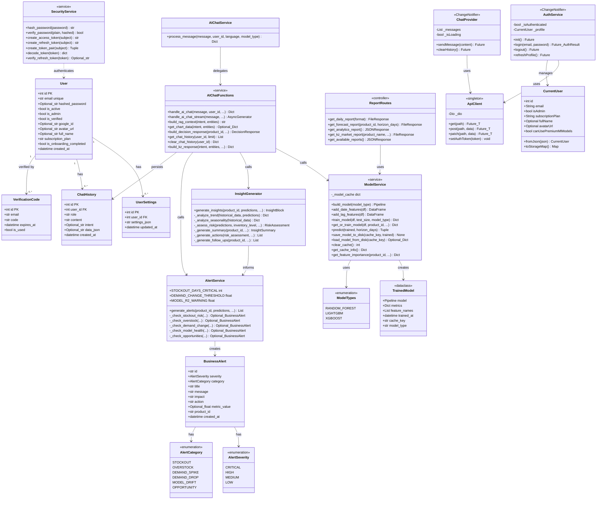

# UML Class Diagram — Forecast AI (Реальная архитектура)
### На основе фактического кода проекта

---

## PlantUML (для диплома)

```plantuml
@startuml ForecastAI_Real_ClassDiagram
!theme plain
skinparam classAttributeIconSize 0
skinparam classFontSize 11
skinparam classFontName Arial
skinparam classBackgroundColor #FFFFFF
skinparam classBorderColor #555555
skinparam classArrowColor #333333
skinparam packageBackgroundColor #F5F7FF
skinparam packageBorderColor #8090C0
skinparam packageFontStyle bold
skinparam linetype ortho
skinparam nodesep 60
skinparam ranksep 80

' ════════════════════════════════════════════
' DATABASE MODELS (SQLAlchemy ORM)
' ════════════════════════════════════════════
package "Database Models (SQLAlchemy)" #EEF2FF {

    class User {
        +id : int <<PK>>
        +email : str <<unique>>
        +hashed_password : Optional[str]
        +is_active : bool = True
        +is_admin : bool = False
        +is_verified : bool = False
        +google_id : Optional[str] <<unique>>
        +avatar_url : Optional[str]
        +full_name : Optional[str]
        +subscription_plan : str = "free"
        +is_onboarding_completed : bool
        +created_at : datetime
    }

    class UserSettings {
        +id : int <<PK>>
        +user_id : int <<FK, unique>>
        +settings_json : str
        +updated_at : datetime
    }

    class ChatHistory {
        +id : int <<PK>>
        +user_id : int <<FK>>
        +role : str
        +content : str
        +intent : Optional[str]
        +data_json : Optional[str]
        +created_at : datetime
    }

    class VerificationCode {
        +id : int <<PK>>
        +email : str
        +code : str
        +created_at : datetime
        +expires_at : datetime
        +is_used : bool = False
    }
}

' ════════════════════════════════════════════
' AUTHENTICATION SCHEMAS (Pydantic)
' ════════════════════════════════════════════
package "Auth Schemas (Pydantic)" #F0FFF4 {

    class SendCodeRequest {
        +email : EmailStr
    }

    class VerifyCodeRequest {
        +email : EmailStr
        +code : str
    }

    class CompleteRegistrationRequest {
        +email : EmailStr
        +code : str
        +password : str
    }

    class LoginRequest {
        +email : EmailStr
        +password : str
    }

    class GoogleAuthRequest {
        +credential : str
    }

    class TokenPairResponse {
        +access_token : str
        +refresh_token : str
        +token_type : str
        +is_admin : bool
        +email : Optional[str]
    }

    class UserResponse {
        +id : int
        +email : str
        +is_active : bool
        +is_admin : bool
        +is_verified : bool
        +subscription_plan : str
        +full_name : Optional[str]
        +avatar_url : Optional[str]
        +created_at : Optional[datetime]
        +is_onboarding_completed : bool
    }

    class UpdateProfileRequest {
        +full_name : Optional[str]
    }

    class MockSubscribeRequest {
        +plan : str
    }
}

' ════════════════════════════════════════════
' SECURITY SERVICE
' ════════════════════════════════════════════
package "Security Service" #FFFBF0 {

    class SecurityService {
        <<service>>
        +hash_password(password: str) : str
        +verify_password(plain: str, hashed: str) : bool
        +create_access_token(subject: str) : str
        +create_refresh_token(subject: str) : str
        +create_token_pair(subject: str) : Tuple[str,str]
        +decode_token(token: str) : dict
        +verify_refresh_token(token: str) : Optional[str]
    }
}

' ════════════════════════════════════════════
' ML & FORECASTING SERVICE
' ════════════════════════════════════════════
package "ML & Forecasting Service" #FFF0F0 {

    class ModelService {
        <<service>>
        -_model_cache : dict
        +get_cache_key(product_id, store_id, model_type) : str
        +build_model(model_type: str) : Pipeline
        +add_date_features(df: DataFrame) : DataFrame
        +add_lag_features(df: DataFrame) : DataFrame
        +calculate_metrics(y_true, y_pred) : Dict
        +train_model(df, test_size, model_type) : Dict
        +get_or_train_model(df, product_id, store_id, force_retrain, model_type) : Dict
        +predict(trained: Dict, horizon_days: int) : Tuple
        +save_model_to_disk(cache_key: str, trained: Dict) : None
        +load_model_from_disk(cache_key: str) : Optional[Dict]
        +clear_cache() : int
        +get_cache_info() : Dict
        +get_feature_importance(product_id, store_id, model_type) : Dict
        +get_model_structure() : Dict
        +predict_from_market_data(price_usd, competitor_price_usd, ...) : Dict
    }

    class ModelTypes {
        <<enumeration>>
        RANDOM_FOREST
        LIGHTGBM
        XGBOOST
    }

    class TrainedModel {
        <<dataclass>>
        +model : Pipeline
        +metrics : Dict[str, float]
        +feature_names : List[str]
        +trained_at : datetime
        +cache_key : str
        +model_type : str
    }

    class ForecastService {
        <<service>>
        +get_forecast_chart(product_id: str, horizon_days: int) : Dict
    }
}

' ════════════════════════════════════════════
' AI ASSISTANT SERVICE
' ════════════════════════════════════════════
package "AI Assistant Service" #F5F0FF {

    class AIChatService {
        +process_message(message: str, user_id: int, language: str, model_type: str) : Dict
    }

    class AIChatFunctions {
        <<service>>
        +handle_ai_chat(message, user_id, language, model_type, subscription_plan) : Dict
        +handle_ai_chat_stream(message, user_id, language, model_type, subscription_plan) : AsyncGenerator
        +build_rag_context(intent: Intent, entities: Dict) : str
        +get_chart_data(intent: Intent, entities: Dict) : Optional[Dict]
        +get_product_images(intent: Intent, entities: Dict) : Optional[List]
        +build_decision_response(product_id, intent, entities, df, horizon_days, store_id, model_type) : DecisionAssistantChatResponse
        +get_chat_history(user_id: int, limit: int) : List[Dict]
        +clear_chat_history(user_id: int) : Dict
        +get_analytics_summary() : Dict
        +get_analytics_trends() : Dict
        +build_kz_response(intent, entities, message, user_id) : Dict
    }
}

' ════════════════════════════════════════════
' INSIGHT & ALERT SERVICES
' ════════════════════════════════════════════
package "Insight & Alert Services" #F0FFF8 {

    class InsightGenerator {
        +generate_insights(product_id, predictions, historical_data, model_metrics, feature_importances, inventory_level, category) : InsightBlock
        -_analyze_trend(historical_data, predictions) : Dict
        -_analyze_seasonality(historical_data) : Dict
        -_assess_risk(predictions, inventory_level, trend, model_metrics) : RiskAssessment
        -_generate_summary(product_id, predictions, trend, category) : InsightSummary
        -_generate_why(trend, seasonality, feature_importances) : WhyItHappened
        -_generate_actions(risk_assessment, predictions, inventory_level, trend) : List[ActionItem]
        -_generate_follow_ups(product_id, category, risk_assessment, trend) : List[FollowUpQuestion]
    }

    class AlertService {
        +STOCKOUT_DAYS_CRITICAL : int = 2
        +STOCKOUT_DAYS_HIGH : int = 5
        +OVERSTOCK_DAYS_THRESHOLD : int = 60
        +DEMAND_CHANGE_THRESHOLD : float = 0.25
        +MODEL_R2_WARNING : float = 0.6
        +MODEL_R2_CRITICAL : float = 0.4
        +generate_alerts(product_id, predictions, historical_data, model_metrics, inventory_level, category, avg_daily_sales) : List[BusinessAlert]
        -_check_stockout_risk(...) : Optional[BusinessAlert]
        -_check_overstock(...) : Optional[BusinessAlert]
        -_check_demand_change(...) : Optional[BusinessAlert]
        -_check_model_health(...) : Optional[BusinessAlert]
        -_check_opportunities(...) : Optional[BusinessAlert]
    }

    class BusinessAlert {
        +id : str
        +severity : AlertSeverity
        +category : AlertCategory
        +title : str
        +message : str
        +impact : str
        +action : str
        +metric_value : Optional[float]
        +metric_unit : Optional[str]
        +product_id : str
        +created_at : datetime
        +expires_at : Optional[datetime]
        +icon : str
        +color : str
    }

    enum AlertSeverity {
        CRITICAL
        HIGH
        MEDIUM
        LOW
    }

    enum AlertCategory {
        STOCKOUT
        OVERSTOCK
        DEMAND_SPIKE
        DEMAND_DROP
        MODEL_DRIFT
        DATA_QUALITY
        OPPORTUNITY
    }
}

' ════════════════════════════════════════════
' REPORT SERVICE
' ════════════════════════════════════════════
package "Report Service" #FFFFF0 {

    class ReportRequest {
        +report_type : str
        +product_id : Optional[str]
        +date_from : Optional[str]
        +date_to : Optional[str]
    }

    class ReportRoutes {
        <<controller>>
        +get_daily_report(format: str) : FileResponse
        +get_forecast_report(product_id: str, horizon_days: int) : FileResponse
        +get_analytics_report() : JSONResponse
        +get_kz_market_report(product_name, wholesale_price, markup_percent) : FileResponse
        +get_available_reports() : JSONResponse
    }
}

' ════════════════════════════════════════════
' MOBILE APP MODELS (Flutter/Dart)
' ════════════════════════════════════════════
package "Mobile App Models (Flutter)" #FFF5EE {

    class CurrentUser {
        +id : int
        +email : String
        +isAdmin : bool
        +subscriptionPlan : String
        +fullName : Optional[String]
        +avatarUrl : Optional[String]
        +createdAt : Optional[DateTime]
        +canUsePremiumMlModels : bool <<computed>>
        +fromJson(json: Map) : CurrentUser
        +toStorageMap() : Map
    }

    class AuthService {
        <<ChangeNotifier>>
        -_isLoading : bool
        -_isAuthenticated : bool
        -_profile : Optional[CurrentUser]
        -_error : Optional[String]
        +isLoading : bool <<get>>
        +isAuthenticated : bool <<get>>
        +profile : Optional[CurrentUser] <<get>>
        +canUsePremiumMlModels : bool <<get>>
        +init() : Future[void]
        +login(email, password) : Future[AuthResult]
        +logout() : Future[void]
        +refreshProfile() : Future[void]
        +sendVerificationCode(email) : Future[AuthResult]
        +verifyCode(email, code) : Future[AuthResult]
        +completeRegistration(email, code, password) : Future[AuthResult]
    }

    class ApiClient {
        <<singleton>>
        -_dio : Dio
        +baseUrl : String
        +get(path, queryParams) : Future[T]
        +post(path, data) : Future[T]
        +put(path, data) : Future[T]
        +patch(path, data) : Future[T]
        +delete(path) : Future[void]
        +setAuthToken(token: String) : void
        +clearAuthToken() : void
    }

    class ChatProvider {
        <<ChangeNotifier>>
        -_messages : List[ChatMessage]
        -_isLoading : bool
        -_selectedModel : String
        -_language : String
        +messages : List[ChatMessage] <<get>>
        +isLoading : bool <<get>>
        +sendMessage(content: String) : Future[void]
        +clearHistory() : Future[void]
    }

    class Conversation {
        +id : String
        +title : String
        +createdAt : DateTime
        +lastMessageAt : DateTime
        +messages : List[ChatMessage]
    }
}

' ════════════════════════════════════════════
' RELATIONSHIPS
' ════════════════════════════════════════════

' --- DB Model Relations ---
User "1" --> "0..*" UserSettings : has (user_id FK)
User "1" --> "0..*" ChatHistory : has (user_id FK)
User "1" --> "0..*" VerificationCode : verified by (email)

' --- Auth Flow ---
SecurityService ..> User : authenticates >
SecurityService ..> TokenPairResponse : creates >
GoogleAuthRequest ..> User : creates/updates >

' --- Request/Response ---
LoginRequest ..> SecurityService : uses >
CompleteRegistrationRequest ..> SecurityService : uses >
TokenPairResponse ..> User : represents >
UserResponse ..> User : maps from >

' --- ML Service ---
ModelService --> TrainedModel : creates >
ModelService --> ModelTypes : uses >
ForecastService --> ModelService : uses >

' --- AI Chat ---
AIChatService --> AIChatFunctions : delegates >
AIChatFunctions --> ModelService : calls >
AIChatFunctions --> InsightGenerator : calls >
AIChatFunctions --> AlertService : calls >
AIChatFunctions --> ChatHistory : persists to >

' --- Alerts & Insights ---
AlertService --> BusinessAlert : creates >
BusinessAlert --> AlertSeverity : has >
BusinessAlert --> AlertCategory : has >
InsightGenerator --> AlertService : informs >

' --- Reports ---
ReportRoutes --> ReportRequest : accepts >
ReportRoutes --> ModelService : uses >

' --- Mobile ---
AuthService --> ApiClient : uses >
AuthService --> CurrentUser : manages >
ChatProvider --> ApiClient : uses >
ChatProvider --> Conversation : manages >

@enduml
```

---

## Mermaid Code (для онлайн-просмотра)

---

## Итоговая таблица классов

| Класс | Слой | Источник |
|-------|------|---------|
| `User` | DB Model | `back/app/models.py` |
| `UserSettings` | DB Model | `back/app/models.py` |
| `ChatHistory` | DB Model | `back/app/models.py` |
| `VerificationCode` | DB Model | `back/app/models.py` |
| `LoginRequest` | Schema | `back/app/schemas.py` |
| `TokenPairResponse` | Schema | `back/app/schemas.py` |
| `UserResponse` | Schema | `back/app/schemas.py` |
| `GoogleAuthRequest` | Schema | `back/app/schemas.py` |
| `SecurityService` | Service | `back/app/security.py` |
| `ModelService` | Service | `back/services/model_service.py` |
| `TrainedModel` | Dataclass | `back/services/model_service.py` |
| `ModelTypes` | Enum | `back/services/model_service.py` |
| `ForecastService` | Service | `back/services/forecast_service.py` |
| `AIChatService` | Service | `back/services/ai_chat_service.py` |
| `AIChatFunctions` | Service | `back/services/ai_chat_service.py` |
| `InsightGenerator` | Service | `back/services/insight_service.py` |
| `AlertService` | Service | `back/services/alert_service.py` |
| `BusinessAlert` | Dataclass | `back/services/alert_service.py` |
| `AlertSeverity` | Enum | `back/services/alert_service.py` |
| `AlertCategory` | Enum | `back/services/alert_service.py` |
| `ReportRoutes` | Controller | `back/app/report_routes.py` |
| `CurrentUser` | Mobile Model | `prodbot_ai/lib/data/models/current_user.dart` |
| `AuthService` | Mobile Service | `prodbot_ai/lib/services/auth_service.dart` |
| `ApiClient` | Mobile Service | `prodbot_ai/lib/services/api/api_client.dart` |
| `ChatProvider` | Mobile Provider | `prodbot_ai/lib/services/chat_provider.dart` |

---

*Все классы, атрибуты и методы взяты напрямую из фактического кода проекта.*
