# Use Case Diagram — Forecast AI
### Диаграмма Вариантов Использования

---

## PlantUML

```plantuml
@startuml ForecastAI_UseCaseDiagram
!theme plain
skinparam actorStyle awesome
skinparam usecaseFontSize 12
skinparam usecaseFontName Arial
skinparam actorFontSize 13
skinparam actorFontName Arial
skinparam packageFontSize 13
skinparam packageFontStyle bold
skinparam backgroundColor #FFFFFF
skinparam usecaseBackgroundColor #F8F9FF
skinparam usecaseBorderColor #5566AA
skinparam actorBackgroundColor #DDEEFF
skinparam actorBorderColor #3355AA
skinparam packageBackgroundColor #FAFBFF
skinparam packageBorderColor #8899CC
skinparam arrowColor #445599
skinparam linetype ortho

' ════════════════════════════
' ACTORS
' ════════════════════════════
actor "Гость\n(Guest)" as Guest #DDEECC
actor "Пользователь\n(User)" as User #CCEEDD
actor "Pro\nПользователь" as ProUser #CCDDFF
actor "Администратор\n(Admin)" as Admin #FFDDCC
actor "OpenAI GPT-4o\n(External)" as OpenAI #EEEEEE
actor "Google OAuth\n(External)" as GoogleAPI #EEEEEE

' Inheritance: ProUser extends User
User <|-- ProUser
User <|-- Admin

' ════════════════════════════
' AUTHENTICATION MODULE
' ════════════════════════════
rectangle "Модуль Аутентификации" {
    usecase "Зарегистрироваться\nпо Email" as UC_Register
    usecase "Отправить\nкод верификации" as UC_SendCode
    usecase "Подтвердить\nкод" as UC_VerifyCode
    usecase "Завершить\nрегистрацию" as UC_CompleteReg
    usecase "Войти\nEmail/Пароль" as UC_Login
    usecase "Войти через\nGoogle OAuth" as UC_GoogleLogin
    usecase "Обновить\nтокен (JWT)" as UC_RefreshToken
    usecase "Выйти из\nсистемы" as UC_Logout
    usecase "Просмотреть\nпрофиль" as UC_ViewProfile
    usecase "Редактировать\nимя профиля" as UC_EditProfile
}

' ════════════════════════════
' AI CHAT MODULE
' ════════════════════════════
rectangle "Модуль AI Чата" {
    usecase "Отправить\nсообщение AI" as UC_Chat
    usecase "Получить ответ\nс стримингом" as UC_Stream
    usecase "Определить\nнамерение (NLU)" as UC_Intent
    usecase "Построить\nRAG контекст" as UC_RAG
    usecase "Просмотреть\nисторию чата" as UC_ChatHistory
    usecase "Очистить\nисторию чата" as UC_ClearHistory
    usecase "Анализ\nКЗ рынка (чат)" as UC_KZChat
}

' ════════════════════════════
' FORECASTING MODULE
' ════════════════════════════
rectangle "Модуль Прогнозирования" {
    usecase "Получить\nпрогноз (7 дней)" as UC_Forecast7
    usecase "Получить\nпрогноз (30 дней)" as UC_Forecast30
    usecase "Просмотреть\nграфик прогноза" as UC_ForecastChart
    usecase "Сравнить\nмодели" as UC_CompareModels
    usecase "Обучить\nML модель" as UC_TrainModel
    usecase "Получить Feature\nImportance" as UC_FeatureImp
}

' ════════════════════════════
' ANALYTICS MODULE
' ════════════════════════════
rectangle "Модуль Аналитики" {
    usecase "Просмотреть\nсводную аналитику" as UC_Summary
    usecase "Просмотреть\nрыночные тренды" as UC_Trends
    usecase "Анализ\nКЗ рынка (16+ городов)" as UC_KZMarket
    usecase "Анализ\nцен конкурентов" as UC_Competitors
    usecase "Получить\nбизнес инсайты" as UC_Insights
    usecase "Получить\nалерты рисков" as UC_Alerts
}

' ════════════════════════════
' REPORTS MODULE
' ════════════════════════════
rectangle "Модуль Отчётов" {
    usecase "Скачать\nежедневный отчёт" as UC_DailyReport
    usecase "Скачать\nотчёт прогноза" as UC_ForecastReport
    usecase "Скачать\nаналитический отчёт" as UC_AnalyticsReport
    usecase "Скачать\nотчёт КЗ рынка" as UC_KZReport
    usecase "Экспорт\nв Excel" as UC_Excel
    usecase "Экспорт\nв CSV" as UC_CSV
}

' ════════════════════════════
' SETTINGS MODULE
' ════════════════════════════
rectangle "Настройки" {
    usecase "Просмотреть\nнастройки" as UC_Settings
    usecase "Изменить\nязык (KK/RU/EN)" as UC_Language
    usecase "Изменить\nтему (dark/light)" as UC_Theme
    usecase "Управлять\nподпиской" as UC_Subscription
}

' ════════════════════════════
' ADMIN MODULE
' ════════════════════════════
rectangle "Модуль Администрирования" {
    usecase "Просмотреть\nпанель директора" as UC_Dashboard
    usecase "Управлять\nпользователями" as UC_UserMgmt
    usecase "Деактивировать\nпользователя" as UC_Deactivate
    usecase "Назначить\nроль" as UC_AssignRole
    usecase "Мониторинг\nML моделей" as UC_ModelMonitor
    usecase "Просмотреть\nактивные алерты" as UC_AdminAlerts
    usecase "Отправить\nTelegram уведомление" as UC_Telegram
}

' ════════════════════════════
' GUEST CONNECTIONS
' ════════════════════════════
Guest --> UC_Register
Guest --> UC_Login
Guest --> UC_GoogleLogin

' ════════════════════════════
' USER CONNECTIONS
' ════════════════════════════
User --> UC_Logout
User --> UC_ViewProfile
User --> UC_EditProfile
User --> UC_Chat
User --> UC_ChatHistory
User --> UC_ClearHistory
User --> UC_Forecast7
User --> UC_ForecastChart
User --> UC_Summary
User --> UC_Trends
User --> UC_Insights
User --> UC_Alerts
User --> UC_DailyReport
User --> UC_ForecastReport
User --> UC_AnalyticsReport
User --> UC_Settings
User --> UC_Language
User --> UC_Theme
User --> UC_Subscription

' ════════════════════════════
' PRO USER CONNECTIONS
' ════════════════════════════
ProUser --> UC_Forecast30
ProUser --> UC_CompareModels
ProUser --> UC_KZMarket
ProUser --> UC_Competitors
ProUser --> UC_KZChat
ProUser --> UC_KZReport
ProUser --> UC_Excel
ProUser --> UC_CSV

' ════════════════════════════
' ADMIN CONNECTIONS
' ════════════════════════════
Admin --> UC_Dashboard
Admin --> UC_UserMgmt
Admin --> UC_Deactivate
Admin --> UC_AssignRole
Admin --> UC_ModelMonitor
Admin --> UC_AdminAlerts
Admin --> UC_Telegram
Admin --> UC_TrainModel
Admin --> UC_FeatureImp

' ════════════════════════════
' EXTERNAL SYSTEM CONNECTIONS
' ════════════════════════════
OpenAI --> UC_Chat : generates response
OpenAI --> UC_Stream : streams tokens
GoogleAPI --> UC_GoogleLogin : verifies token

' ════════════════════════════
' INCLUDE / EXTEND RELATIONS
' ════════════════════════════
UC_Register ..> UC_SendCode : <<include>>
UC_Register ..> UC_VerifyCode : <<include>>
UC_Register ..> UC_CompleteReg : <<include>>
UC_Login ..> UC_RefreshToken : <<extend>>
UC_GoogleLogin ..> UC_RefreshToken : <<extend>>
UC_Chat ..> UC_Stream : <<include>>
UC_Chat ..> UC_Intent : <<include>>
UC_Chat ..> UC_RAG : <<include>>
UC_DailyReport ..> UC_Excel : <<include>>
UC_ForecastReport ..> UC_Excel : <<include>>
UC_KZReport ..> UC_Excel : <<include>>
UC_Forecast7 ..> UC_TrainModel : <<include>>
UC_Forecast30 ..> UC_TrainModel : <<include>>
UC_UserMgmt ..> UC_Deactivate : <<include>>
UC_UserMgmt ..> UC_AssignRole : <<include>>

@enduml
```

---

## Mermaid (упрощённый вариант)

```mermaid
graph TB
    subgraph Actors["Действующие лица"]
        G["👤 Гость"]
        U["👤 Пользователь (Free)"]
        P["👤 Pro Пользователь"]
        A["👤 Администратор"]
    end

    subgraph Auth["🔐 Аутентификация"]
        UC1["Регистрация по Email"]
        UC2["Вход Email/Пароль"]
        UC3["Вход через Google OAuth"]
        UC4["Обновление JWT токена"]
        UC5["Редактирование профиля"]
    end

    subgraph Chat["🤖 AI Чат"]
        UC6["Отправить сообщение AI"]
        UC7["Стриминг ответа (SSE)"]
        UC8["NLU: определить намерение"]
        UC9["Построить RAG контекст"]
        UC10["История чата"]
        UC11["Очистить историю"]
    end

    subgraph Forecast["📈 Прогнозирование"]
        UC12["Прогноз 7 дней (Free)"]
        UC13["Прогноз 30 дней (Pro)"]
        UC14["График прогноза"]
        UC15["Сравнить модели RF/LGB/XGB"]
    end

    subgraph Analytics["📊 Аналитика"]
        UC16["Сводная аналитика"]
        UC17["Рыночные тренды"]
        UC18["Анализ КЗ рынка 16+ городов"]
        UC19["Цены конкурентов"]
        UC20["Бизнес инсайты"]
        UC21["Алерты рисков"]
    end

    subgraph Reports["📄 Отчёты"]
        UC22["Ежедневный отчёт Excel"]
        UC23["Отчёт прогноза Excel"]
        UC24["Отчёт КЗ рынка Excel"]
    end

    subgraph Admin["⚙️ Администрирование"]
        UC25["Панель директора"]
        UC26["Управление пользователями"]
        UC27["Мониторинг ML моделей"]
        UC28["Telegram уведомления"]
    end

    G --> UC1
    G --> UC2
    G --> UC3

    U --> UC2
    U --> UC5
    U --> UC6
    U --> UC10
    U --> UC11
    U --> UC12
    U --> UC14
    U --> UC16
    U --> UC17
    U --> UC20
    U --> UC21
    U --> UC22
    U --> UC23

    P --> UC13
    P --> UC15
    P --> UC18
    P --> UC19
    P --> UC24

    A --> UC25
    A --> UC26
    A --> UC27
    A --> UC28

    UC6 --> UC7
    UC6 --> UC8
    UC6 --> UC9
    UC1 --> UC4
    UC2 --> UC4
```

---

## Таблица вариантов использования

### По акторам

| Актор | Варианты использования |
|-------|----------------------|
| **Гость** | Регистрация по Email (3 шага), Вход Email/Пароль, Вход через Google OAuth |
| **Пользователь (Free)** | Все функции гостя + AI чат, история чата, прогноз 7 дней, график, аналитика, инсайты, алерты, отчёты (Excel), настройки языка и темы |
| **Pro Пользователь** | Все функции Free + прогноз 30 дней, LightGBM/XGBoost модели, КЗ рынок (16+ городов), цены конкурентов, отчёт КЗ рынка |
| **Администратор** | Все функции + панель директора, CRUD пользователей, мониторинг ML, Telegram алерты, управление кэшем |
| **OpenAI GPT-4o** | Генерация AI ответов, стриминг токенов |
| **Google OAuth API** | Верификация Google ID токена |

### Include / Extend отношения

| Use Case | Тип | Зависит от |
|----------|-----|-----------|
| Регистрация | `<<include>>` | Отправить код → Подтвердить код → Завершить регистрацию |
| Вход / Google OAuth | `<<extend>>` | Обновление JWT токена |
| AI Чат | `<<include>>` | Стриминг ответа + NLU намерение + RAG контекст |
| Скачать отчёт (любой) | `<<include>>` | Экспорт в Excel |
| Прогноз (Free/Pro) | `<<include>>` | Обучить/загрузить ML модель |
| Управление пользователями | `<<include>>` | Деактивация + Назначение роли |

---

*Use Case Diagram v1.0 | Forecast AI | 2025–2026*